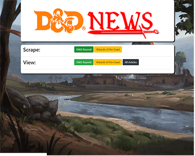

# D&D News Scraper

## What is it? 
The D&D News Scraper is an application that allows its users to scrape for the latest news articles from two D&D related websites: D&D Beyond and Wizards of the Coast. 
Users can then comment on articles of interest and save them. 

***

## User Interaction
When the user enters the page they are led to a page where they can choose to scrape for new articles from either D&D Beyond or Wizards of the Coast. 

## What technologies are used? 
The technologies used in this News Scraper include: 

* HTML
* CSS
* JavaScript
* Handlebars
* Node (primarily the cheerio and axios packages)
* MongoDB
* Express

***

## How to Initialize the D&D Scraper on your own machine
1. Git clone the repository
2. Navigate to the repository in terminal or bash
3. Type npm i
4. Type node server (or nodemon server)

***
## Future Development
1. Adding a user database and authentication process so that users can save articles to their account

***
## See the App in Action
[See the App in Action](https://still-falls-80440.herokuapp.com/)
